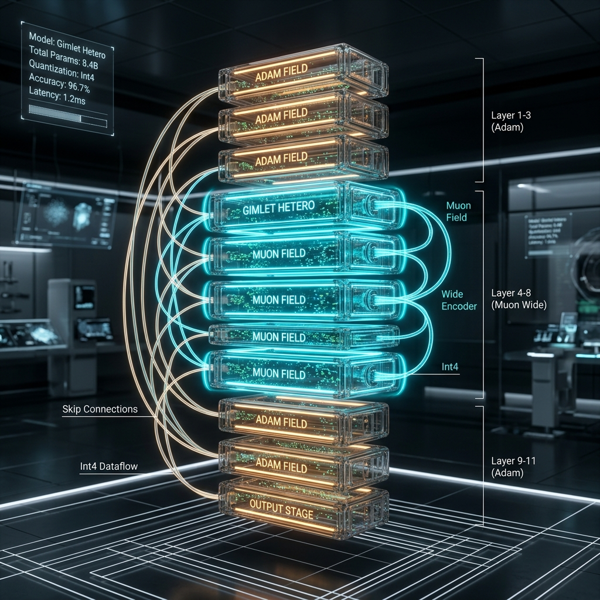

# Gimlet Hetero Architecture Visualization

I have updated the visualization to a more premium, technical 3D blueprint. This version uses an "exploded sectional view" and crystalline modules to better showcase the structural complexity of **Gimlet Hetero**.

- **Technical Sections**: Clearly labeled "Adam Field" (Early/Late) and "Muon Field" (Middle).
- **Core Insights**: The wider "Muon Field" modules visually depict the increased MLP multiplier for the 5 middle layers.
- **Circuitry Detail**: Individual data particles now represent the **Int4 Quantization** flow within the 16MB constraint.

This image should be suitable for project presentations, documentation headers, or general design reference.

> [!TIP]
> This visualization emphasizes the "Middle" layer dominance which is critical for your Muon-driven optimization strategy.
